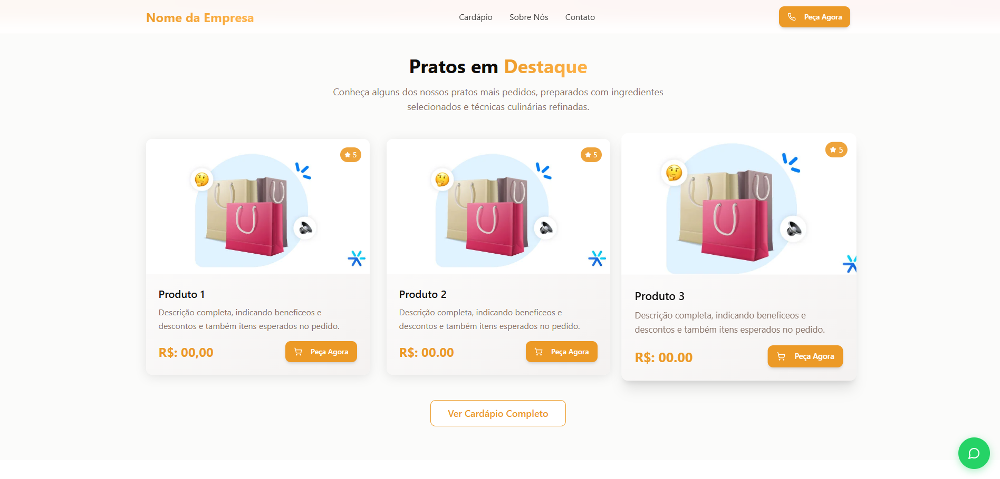
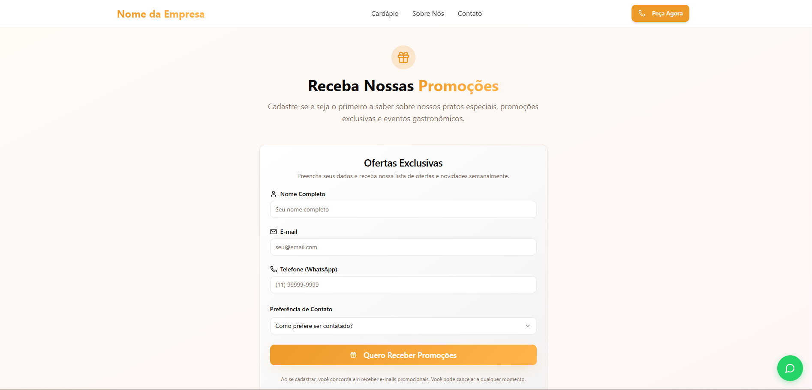

# 🍽️ Sabor Encanta Restaurante

Um site institucional moderno para restaurante, desenvolvido com React, TypeScript e TailwindCSS.

---

## 🚀 Links Importantes

- 🌐 Site em Produção: (https://sabor-encanta-restaurante.vercel.app/)
- 🔗 Repositório: https://github.com/JosueCosta2023/sabor-encanta-restaurante

---

## 📋 Funcionalidades

- Página inicial com apresentação do restaurante
- Seção de pratos em destaque
- Depoimentos de clientes
- Formulário de contato (Lead Form)
- Informações de endereço, telefone e redes sociais
- Layout responsivo e moderno

---

## 🛠️ Tecnologias Utilizadas

- ⚡ Framework: React 18+
- 🔷 Linguagem: TypeScript
- 💅 Estilização: TailwindCSS
- ⚙️ Build: Vite
- 🖼️ Imagens otimizadas

---

## ⚡ Instalação e Uso

### Pré-requisitos

- Node.js 18+
- Git

### 1. Clone o repositório:

```bash
git clone https://github.com/JosueCosta2023/sabor-encanta-restaurante.git
cd sabor-encanta-restaurante
```

### 2. Instale as dependências:

```bash
npm install
```

### 3. Inicie o servidor de desenvolvimento:

```bash
npm run dev
```

### 4. Build para produção:

```bash
npm run build
```

---

## 📁 Estrutura do Projeto

```
src/
├── assets/           # Imagens e mídias
├── components/       # Componentes reutilizáveis
│   └── ui/           # Componentes de UI (botão, card, etc)
├── hooks/            # Hooks customizados
├── lib/              # Funções utilitárias
├── pages/            # Páginas principais
├── App.tsx           # Componente principal
├── main.tsx          # Ponto de entrada
└── variables.ts      # Variáveis institucionais
```

---

## 🧪 Scripts Disponíveis

- `npm run dev` # Inicia servidor de desenvolvimento
- `npm run build` # Build para produção
- `npm run preview` # Visualiza build de produção localmente

---

## 🌍 Deploy

O deploy pode ser feito facilmente em plataformas como Vercel, Netlify ou GitHub Pages.

### Passos básicos:

1. Faça o build do projeto: `npm run build`
2. Faça upload da pasta `dist/` para o serviço de hospedagem

---

## 🤝 Contribuição

1. Faça um fork do projeto
2. Crie uma branch para sua feature (`git checkout -b feature/NovaFeature`)
3. Commit suas mudanças (`git commit -m 'feat: NovaFeature'`)
4. Push para a branch (`git push origin feature/NovaFeature`)
5. Abra um Pull Request


## 🛣️ Ilustração

### Desktop




### Mobile
<div style="display: flex; justify-content: space-between;">
  
  
  
</div>


## 👨‍💻 **Autor**

### Josué Ocanha Costa
#### FrontEnd Developer
#### Redes Sociais

- Linkedin - [JosueOcanhaCosta](https://www.linkedin.com/in/josue-ocanha-costa/)
- Github - [JosueCosta2023](https://github.com/JosueCosta2023)
- Twitter - [@JosueOcanhaCosta](https://twitter.com/josue_ocanha)
- Facebook - [JosueCosta](https://www.facebook.com/JosueOcanhaCosta2023)
- Whatsapp - [Josue2023](https://wa.me/5565996408371?text=Ol%C3%A1%2C+encontrei+seu+whatsapp+no+Github.+Gostaria+de+falar+sobre+seus+projetos.)

# "Vida longa e próspera. 🖖🖖🖖"
Feito com o ❤️ por Josué Ocanha Costa

⭐ Se este projeto te ajudou, deixe uma estrela! ⭐

